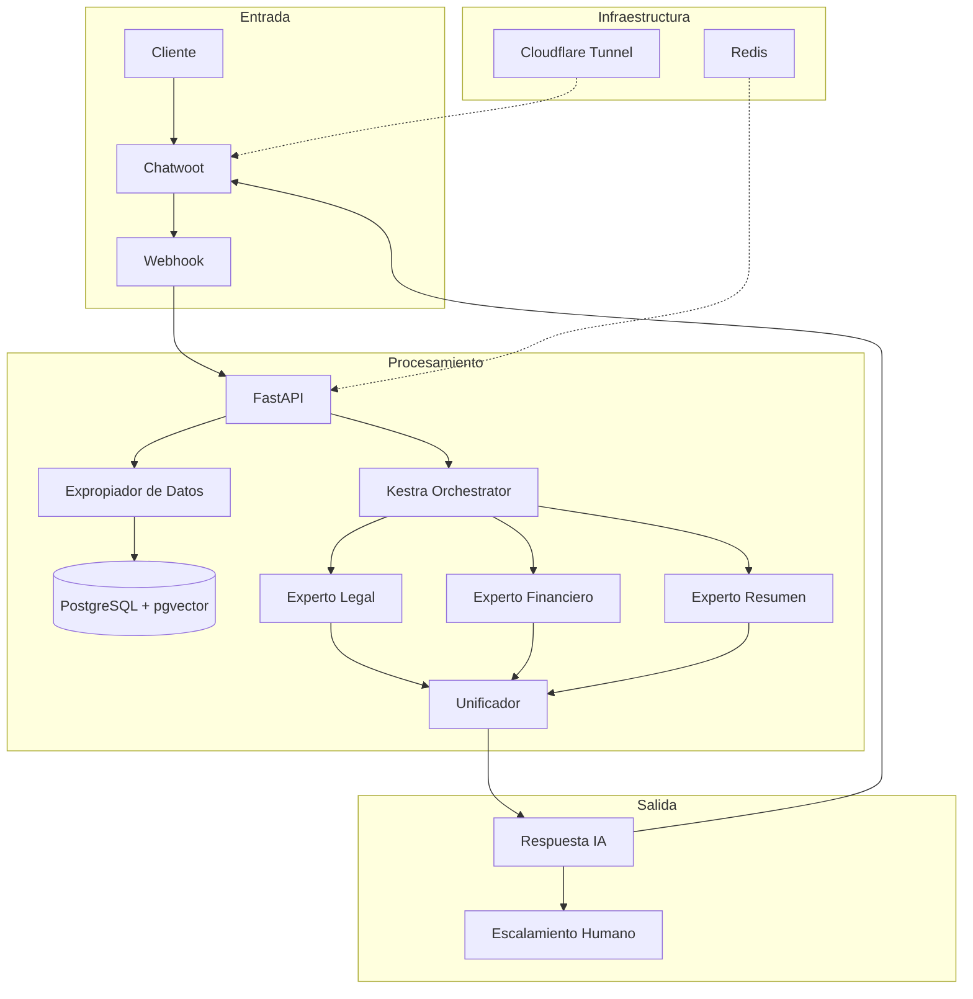

# ChatGravity 🚀

> Sistema de IA Conversacional Empresarial con Arquitectura MoE (Mixture of Experts)

ChatGravity es una plataforma de automatización inteligente de atención al cliente que combina múltiples expertos de IA especializados para proporcionar respuestas contextuales y precisas. Integrado con Chatwoot y orquestado mediante Kestra , en proceso de eliminacion de kestra para usar unicamente lnagraft por eficiencia, el sistema mantiene un historial completo de interacciones y gestiona activos de clientes de forma segura.


---

## 📋 Tabla de Contenidos

- [Características](#-características)
- [Arquitectura](#-arquitectura)
- [Requisitos Previos](#-requisitos-previos)
- [Instalación](#-instalación)
- [Configuración](#-configuración)
- [Uso](#-uso)
- [Estructura del Proyecto](#-estructura-del-proyecto)
- [API Endpoints](#-api-endpoints)
- [Modelo de Datos](#-modelo-de-datos)
- [Desarrollo](#-desarrollo)
- [Seguridad](#-seguridad)
- [Contribuir](#-contribuir)
- [Licencia](#-licencia)

---

## ✨ Características

### 🤖 **Inteligencia Artificial Avanzada**
- **Mixture of Experts (MoE)**: Múltiples agentes especializados trabajando en paralelo
- **RAG (Retrieval Augmented Generation)**: Búsqueda semántica en base de conocimiento
- **Procesamiento Simétrico**: Arquitectura basada en `SenalAgente` para composabilidad infinita
- **Integración con Gemini**: Soporte para modelos Google Gemini 1.5 Pro/Flash

### 💼 **Gestión de Clientes**
- Historial completo de interacciones
- Gestión de activos (documentos, archivos)
- Deduplicación automática por hash SHA-256
- Contexto vivo personalizado por cliente

### 🔄 **Orquestación y Workflows**
- Orquestación con **Kestra** para workflows complejos
- Procesamiento paralelo (Fan-Out/Fan-In)
- Unificación estructural de resultados
- Procesamiento asíncrono con Redis

### 🔐 **Seguridad Empresarial**
- Validación de webhooks con headers secretos
- Sanitización de datos de entrada
- Separación de datos públicos/internos
- Túnel seguro con Cloudflare

### 📊 **Observabilidad**
- Trazabilidad completa de operaciones
- Métricas de tokens y costos
- Auditoría de modelos utilizados
- IDs de correlación entre sistemas

---

## 🏗️ Arquitectura



### Componentes Principales

| Componente | Tecnología | Propósito |
|------------|------------|-----------|
| **API Principal** | FastAPI + Python | Cerebro del sistema, procesamiento de señales |
| **Base de Datos** | PostgreSQL + pgvector | Almacenamiento unificado con vectores |
| **Mensajería** | Chatwoot | Interfaz de comunicación con clientes |
| **Orquestador** | Kestra | Coordinación de workflows y expertos |
| **Caché** | Redis | Colas de mensajes y caché |
| **Túnel** | Cloudflare | Acceso seguro HTTPS |
| **Justibot (BFF)** | FastAPI + WebSockets | Backend for Frontend, Auth, Chat Realtime |

---

## 📦 Requisitos Previos

- **Docker** >= 20.10
- **Docker Compose** >= 2.0
- **Git**
- Claves API:
  - Google Gemini API Key
  - (Opcional) OpenAI API Key
  - Cloudflare Tunnel Token

---

## 🚀 Instalación

### 1. Clonar el Repositorio

```bash
git clone https://github.com/tu-usuario/ChatGravity.git
cd ChatGravity
```

### 2. Configurar Variables de Entorno

```bash
cp .env.example .env
```

Edita `.env` con tus credenciales:

```bash
# Base de Datos
POSTGRES_DB=chatwoot_production
POSTGRES_USER=postgres
POSTGRES_PASSWORD=tu_password_seguro

# APIs de IA
GEMINI_API_KEY=tu_gemini_api_key
OPENAI_API_KEY=tu_openai_api_key  # Opcional

# Seguridad Chatwoot
CHATWOOT_WEBHOOK_SECRET=genera_un_secreto_largo_aleatorio
CHATWOOT_SECRET_KEY=genera_otro_secreto_largo

# Cloudflare (Opcional)
CLOUDFLARE_TUNNEL_TOKEN=tu_tunnel_token
DOMAIN_BASE=tu-dominio.com
```

### 3. Levantar los Servicios

```bash
docker-compose up -d
```

### 4. Verificar Estado

```bash
docker-compose ps
```

Todos los servicios deberían estar en estado `Up`.

### 5. Acceder a las Interfaces

- **API FastAPI**: http://moe_api:8000 (Interno)
- **Documentación API**: http://moe_api:8000/docs
- **Chatwoot**: https://chat.sci-vacasantana.org
- **Kestra**: https://kestra.sci-vacasantana.org

---

## ⚙️ Configuración

### Configuración del Sistema (`config.toml`)

```toml
[sistema]
ambiente = "desarrollo"
idioma_default = "es"
nivel_log = "INFO"

[llm]
modelo_razonamiento = "gemini-1.5-pro"
modelo_rapido = "gemini-1.5-flash"
modelo_embeddings = "text-embedding-3-small"

[vectores]
dimensiones = 1536
metrica = "cosine"
tabla_conocimiento = "base_conocimiento"

[agentes]
estrategia_default = "ANALISIS_GENERAL"
estrategia_fallback = "ESCALAR_HUMANO"
```

### Configurar Chatwoot

1. Accede a Chatwoot (https://chat.sci-vacasantana.org)
2. Crea una cuenta de administrador
3. Configura un inbox (canal de comunicación)
4. En **Settings → Integrations → Webhooks**, agrega:
   - URL: `http://moe_api:8000/api/v1/webhooks/chatwoot`
   - Header: `X-Chatwoot-Signature: [tu_CHATWOOT_WEBHOOK_SECRET]`

---

## 💻 Uso

### Procesamiento de Señales

El endpoint principal recibe y procesa señales de forma simétrica:

```python
import requests

senal = {
    "meta": {
        "origen": "api_publica"
    },
    "instruccion": {
        "tipo_estrategia": "ANALISIS_HECHOS"
    },
    "entrada": {
        "mensaje_texto": "¿Cuáles son los requisitos para una visa de trabajo?"
    },
    "contexto": []
}

response = requests.post(
    "http://localhost:8000/api/v1/procesar_nodo",
    json=senal
)

print(response.json()["analisis"]["respuesta_sugerida"])
```

### Unificación de Resultados (Fan-In)

```python
payload_join = {
    "senales_entrantes": [senal1, senal2, senal3]
}

response = requests.post(
    "http://localhost:8000/api/v1/herramientas/join",
    json=payload_join
)

# Retorna una señal unificada con contexto completo
```

---

## 📁 Estructura del Proyecto

```
ChatGravity/
├── config/
│   └── tunnel.yml              # Configuración Cloudflare Tunnel
├── kestra/
│   └── flows/
│       └── flujo_chatwoot.yaml # Workflow de orquestación
├── public/
│   └── robots.txt              # Configuración SEO
├── scripts/
│   └── init_db.sql             # Script de inicialización DB
├── src/
│   ├── clientes_llm/           # Clientes para APIs de LLM
│   │   └── base.py
│   ├── core/                   # Núcleo del sistema
│   │   ├── protocolos.py       # SenalAgente y contratos
│   │   ├── factory.py          # Factory de estrategias
│   │   └── unificador.py       # Unificador estructural
│   ├── database/               # Capa de datos
│   │   ├── models.py           # Modelos SQLModel
│   │   ├── session.py          # Gestión de sesiones
│   │   └── connector.py        # Conector DB
│   ├── etl/                    # Extracción y transformación
│   │   └── expropiador.py      # Expropiador de datos
│   ├── expertos/               # Agentes especializados
│   │   ├── base.py             # Clase base (Template Method)
│   │   ├── agente_resumen.py
│   │   └── agente_analisis.py
│   ├── infra/                  # Infraestructura
│   │   └── storage.py          # Servicio de almacenamiento
│   ├── rag_engine/             # Motor RAG
│   │   ├── core/
│   │   │   ├── cargadores.py
│   │   │   ├── separadores.py
│   │   │   ├── vectorizador_gemini.py
│   │   │   └── indexador.py
│   │   └── transeunte/
│   │       └── procesador.py
│   ├── config.py               # Configuración global
│   └── main.py                 # Aplicación FastAPI
├── .env.example                # Plantilla de variables
├── config.toml                 # Configuración del sistema
├── docker-compose.yml          # Orquestación de servicios
├── requirements.txt            # Dependencias Python
└── README.md                   # Este archivo
```

---

## 🔌 API Endpoints

### Endpoints Principales

| Método | Endpoint | Descripción |
|--------|----------|-------------|
| `POST` | `/api/v1/procesar_nodo` | Procesa una señal con un experto |
| `POST` | `/api/v1/herramientas/join` | Unifica múltiples señales (Fan-In) |
| `POST` | `/api/v1/webhooks/chatwoot` | Recibe eventos de Chatwoot |
| `GET` | `/health` | Health check del servicio |
| `GET` | `/docs` | Documentación interactiva (Swagger) |

### Ejemplo de Respuesta

```json
{
  "meta": {
    "id_traza": "550e8400-e29b-41d4-a716-446655440000",
    "timestamp_creacion": "2025-11-24T20:00:00",
    "tokens_acumulados": 1250,
    "modelo_ultimo_paso": "gemini-1.5-pro"
  },
  "analisis": {
    "intencion_detectada": "SOLICITUD_INFORMACION_VISA",
    "respuesta_sugerida": "Para una visa de trabajo necesitas...",
    "accion_sugerida": "RESPONDER_TEXTO",
    "razonamiento": "El usuario pregunta sobre requisitos..."
  }
}
```

---

## 🗄️ Modelo de Datos

### Tablas Principales

#### `clientes_activos`
Identidad y contexto de clientes externos.

```sql
CREATE TABLE clientes_activos (
    id_cliente SERIAL PRIMARY KEY,
    credencial_externa VARCHAR UNIQUE NOT NULL,
    contexto_vivo JSONB DEFAULT '{}',
    estado_ciclo VARCHAR DEFAULT 'prospecto',
    ultima_actividad TIMESTAMP DEFAULT NOW()
);
```

#### `transacciones_agente`
Historial completo de interacciones IA-Cliente.

```sql
CREATE TABLE transacciones_agente (
    id_transaccion BIGSERIAL PRIMARY KEY,
    id_cliente INTEGER REFERENCES clientes_activos(id_cliente),
    input_usuario TEXT NOT NULL,
    output_respuesta TEXT,
    intencion_detectada VARCHAR,
    tipo_actor_respuesta VARCHAR NOT NULL,
    razonamiento_tecnico TEXT,
    fecha_cierre TIMESTAMP DEFAULT NOW()
);
```

#### `base_conocimiento`
Documentos vectorizados para RAG.

```sql
CREATE TABLE base_conocimiento (
    id_fragmento SERIAL PRIMARY KEY,
    contenido_textual TEXT NOT NULL,
    vector_embedding vector(768),
    fuente_cita VARCHAR,
    categoria VARCHAR
);
```

---

## 🛠️ Desarrollo

### Agregar un Nuevo Experto

1. Crea un archivo en `src/expertos/`:

```python
# src/expertos/agente_custom.py
from src.expertos.base import EstrategiaBase
from src.core.protocolos import PayloadTecnicoLLM, MensajeNativo

class ExpertoCustom(EstrategiaBase):
    def _fabricar_payload(self, senal):
        system_prompt = "Eres un experto en..."
        
        return PayloadTecnicoLLM(
            mensajes_stack=[
                MensajeNativo(rol="system", contenido=system_prompt),
                MensajeNativo(rol="user", contenido=senal.entrada.mensaje_texto)
            ],
            parametros_api={"temperature": 0.7},
            alias_modelo_objetivo="gemini-1.5-pro"
        )
```

2. Registra en `src/core/factory.py`:

```python
from src.expertos.agente_custom import ExpertoCustom

mapa_estrategias = {
    "CUSTOM": ExpertoCustom,
    # ... otros expertos
}
```

### Ejecutar Tests

```bash
# Instalar dependencias de desarrollo
pip install pytest pytest-asyncio httpx

# Ejecutar tests
pytest tests/
```

### Logs y Debugging

```bash
# Ver logs de la API
docker-compose logs -f api

# Ver logs de Chatwoot
docker-compose logs -f chatwoot_web

# Acceder a la base de datos
docker-compose exec postgres psql -U postgres -d chatwoot_production
```

---

## 🔐 Seguridad

### Mejores Prácticas Implementadas

✅ **Validación de Webhooks**: Headers secretos obligatorios  
✅ **Sanitización de Entrada**: Validación Pydantic en todas las entradas  
✅ **Separación de Datos**: Modelos públicos vs internos  
✅ **Deduplicación Segura**: Hash SHA-256 de archivos  
✅ **Proyección de Salida**: Solo campos seguros expuestos  
✅ **Procesamiento Asíncrono**: No bloquea servicios externos  

### Recomendaciones para Producción

- [ ] Cambiar todos los secretos en `.env`
- [ ] Habilitar HTTPS en Chatwoot
- [ ] Configurar firewall para PostgreSQL
- [ ] Implementar rate limiting en FastAPI
- [ ] Rotar claves API periódicamente
- [ ] Habilitar autenticación en Kestra
- [ ] Configurar backups automáticos de PostgreSQL

---

## 🤝 Contribuir

Las contribuciones son bienvenidas. Por favor:

1. Fork el proyecto
2. Crea una rama para tu feature (`git checkout -b feature/AmazingFeature`)
3. Commit tus cambios (`git commit -m 'Add: Amazing Feature'`)
4. Push a la rama (`git push origin feature/AmazingFeature`)
5. Abre un Pull Request

### Convenciones de Código

- **Idioma**: Código y comentarios en español
- **Estilo**: PEP 8 para Python
- **Commits**: Conventional Commits (Add/Fix/Update/Remove)
- **Documentación**: Docstrings en todas las funciones públicas

---

## 📄 Licencia

Este proyecto está bajo la Licencia MIT. Ver el archivo `LICENSE` para más detalles.

---

## ⚡ Arquitectura Híbrida (Justibot)
Se ha implementado una arquitectura híbrida estricta para garantizar la comunicación en tiempo real y la seguridad:

1.  **Canal Seguro (Backend Proxy)**: `Justibot` actúa como gestor de identidad. Utiliza la **Chatwoot Client API** para crear/actualizar contactos y obtener un `pubsub_token` seguro. Este token se entrega al frontend tras la autenticación.
2.  **Canal Tiempo Real (Directo)**: El frontend (`chat.js`) utiliza el `pubsub_token` para establecer una conexión WebSocket directa con Chatwoot (`wss://[CHATWOOT_URL]/cable`). Esto permite recibir mensajes y eventos de tipeo con latencia cero, sin sobrecargar el backend de Justibot.

> [!NOTE]
> Esta arquitectura resuelve el problema de latencia en la recepción de mensajes del agente, eliminando la necesidad de polling o webhooks complejos para la entrega al cliente final.

---

## 📚 Documentación Extendida

La documentación detallada de arquitectura y decisiones de diseño se encuentra en el directorio [`/docs`](./docs).

> [!IMPORTANT]
> El documento `docs/MigraciónSinKestra.md` requiere refactorización para reflejar los ajustes recientes en el flujo de Login y las sincronizaciones de base de datos.

---

## 📞 Soporte

Para preguntas, problemas o sugerencias:

- **Issues**: [GitHub Issues](https://github.com/tu-usuario/ChatGravity/issues)
- **Documentación**: Ver [`/docs`](./docs)
- **Email**: soporte@tu-dominio.com

---

## 🙏 Agradecimientos

- [FastAPI](https://fastapi.tiangolo.com/) - Framework web moderno
- [Chatwoot](https://www.chatwoot.com/) - Plataforma de mensajería
- [Kestra](https://kestra.io/) - Orquestador de workflows
- [pgvector](https://github.com/pgvector/pgvector) - Extensión de vectores para PostgreSQL
- [Google Gemini](https://ai.google.dev/) - Modelos de lenguaje

---

<div align="center">

**Hecho con ❤️ para automatización inteligente de atención al cliente**

[⬆ Volver arriba](#chatgravity-)

</div>
