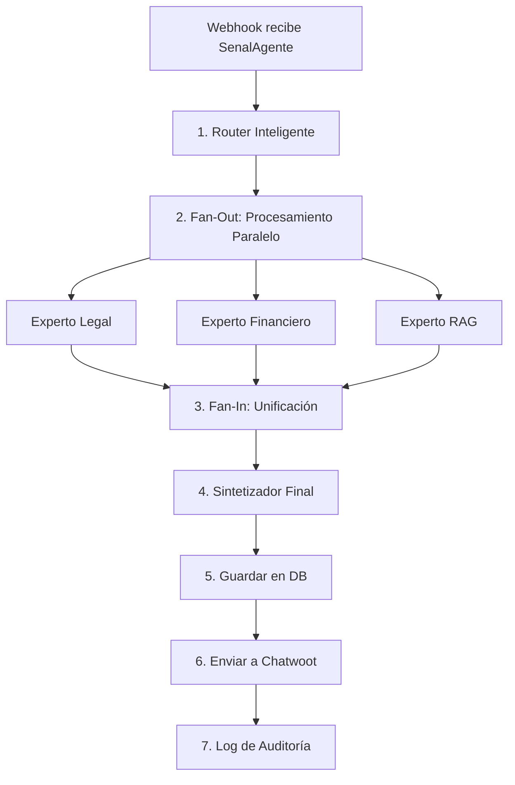

# Implementación del Flujo Orquestado MoE

## 🎯 Resumen de Cambios

Se ha implementado un flujo completo de orquestación conversacional que corrige la arquitectura original y agrega capacidades de procesamiento distribuido con locks y colas.

---

## 📋 Cambios Implementados

### 1. **Nuevo Módulo: `OrquestadorConversacional`**
**Archivo:** `src/core/orquestador.py`

**Responsabilidades:**
- ✅ Genera `SenalAgente` inicial desde datos de Chatwoot expropiados
- ✅ Implementa **locks distribuidos con Redis** para evitar procesamiento concurrente del mismo cliente
- ✅ **Encola mensajes** en Redis cuando un cliente está siendo procesado
- ✅ Recupera historial de chat desde la base de datos
- ✅ Recupera contexto vivo del cliente
- ✅ Dispara workflows de Kestra con la señal depurada
- ✅ Procesa cola de mensajes después de terminar procesamiento actual

**Flujo de Locks:**
```
Cliente envía mensaje
    ↓
¿Lock disponible? → NO → Encolar en Redis
    ↓ SÍ
Adquirir lock
    ↓
Procesar mensaje
    ↓
Invocar Kestra
    ↓
Procesar cola (si hay mensajes)
    ↓
Liberar lock
```

---

### 2. **Actualización del Webhook de Chatwoot**
**Archivo:** `src/main.py` (líneas 87-119)

**Cambios:**
- ✅ **Procesamiento síncrono** (ya no usa `BackgroundTasks`)
- ✅ **Dos pasos claros:**
  1. **Expropiación de datos** (ETL)
  2. **Orquestación conversacional** (solo para mensajes nuevos)
- ✅ Solo responde `{"status": "received"}` si **realmente** se guardó en DB y se disparó Kestra
- ✅ Mejor manejo de errores con traceback completo

**Antes:**
```python
background_tasks.add_task(expropiador.procesar_webhook, payload)
return {"status": "received"}  # ❌ Falso positivo
```

**Ahora:**
```python
resultado = await expropiador.procesar_webhook(payload)
if resultado["status"] == "procesado":
    await orquestador.procesar_mensaje_chatwoot(...)
return {"status": "received"}  # ✅ Solo si realmente se procesó
```

---

### 3. **Nuevo Flujo de Kestra**
**Archivo:** `kestra/flows/flujo_chatwoot.yaml`

**Corrección Arquitectónica:**
- ❌ **Antes:** El flujo comenzaba con expropiación de datos (duplicación de lógica)
- ✅ **Ahora:** El flujo comienza con `SenalAgente` ya depurada

**Pasos del Flujo:**



**Expertos Implementados:**
1. **Router Inteligente**: Decide qué expertos invocar
2. **Experto Legal**: Análisis de normativas y leyes
3. **Experto Financiero**: Cálculos y análisis financiero
4. **Experto RAG**: Búsqueda en base de conocimiento
5. **Sintetizador Final**: Genera respuesta coherente unificada

---

### 4. **Nuevo Endpoint: Guardar Transacciones**
**Archivo:** `src/main.py` (líneas 137-209)

**Endpoint:** `POST /api/v1/transacciones/guardar`

**Funcionalidad:**
- ✅ Persiste la transacción completa en `transacciones_agente`
- ✅ Determina automáticamente `tipo_actor` y `tipo_desenlace`
- ✅ Guarda razonamiento técnico completo
- ✅ Vincula con IDs de Kestra y Chatwoot

**Campos Guardados:**
```sql
- id_cliente
- tipo_actor_respuesta (ia/empleado/sistema)
- tipo_desenlace (respuesta_ia/escalada_humano)
- input_usuario
- output_respuesta
- razonamiento_tecnico
- intencion_detectada
- ids_activos_involucrados
- id_orquestacion_kestra (traza completa)
- id_mensaje_chatwoot
```

---

### 5. **Actualización de Variables de Entorno**
**Archivo:** `.env.example`

**Nuevas Variables:**
```bash
# Redis (Para locks distribuidos y colas)
REDIS_HOST=redis
REDIS_PORT=6379

# Kestra (Orquestador)
KESTRA_URL=http://moe_kestra:8080

# Chatwoot API
CHATWOOT_API_URL=http://moe_chatwoot_web:3000
CHATWOOT_API_TOKEN=tu_api_token_de_chatwoot
```

---

### 6. **Actualización del Modelo `SenalAgente`**
**Archivo:** `src/core/protocolos.py` (línea 148)

**Cambio:**
```python
# Antes:
contexto: List[ItemContexto] = []

# Ahora:
historial_chat: List[MensajeNativo]   # Historial de conversación
contexto: List[ItemContexto] = []      # Contexto adicional (RAG, perfiles)
```

**Razón:** Separar claramente el historial de chat del contexto adicional para mejor organización.

---

## 🔐 Características de Seguridad

### **Locks Distribuidos con Redis**
- ✅ Evita procesamiento concurrente del mismo cliente
- ✅ Timeout automático de 5 minutos (configurable)
- ✅ Liberación garantizada incluso si hay errores (bloque `finally`)

### **Encolamiento Inteligente**
- ✅ Mensajes se encolan si el cliente está ocupado
- ✅ Procesamiento FIFO (First In, First Out)
- ✅ Procesamiento automático de cola después de terminar

### **Procesamiento Síncrono**
- ✅ No hay falsos positivos a Chatwoot
- ✅ Si falla, Chatwoot puede reintentar
- ✅ Trazabilidad completa de errores

---

## 🚀 Flujo Completo End-to-End

```
1. Usuario envía mensaje en Chatwoot
   ↓
2. Chatwoot dispara webhook → FastAPI
   ↓
3. FastAPI valida header secreto
   ↓
4. ExpropiadorDeDatos:
   - Crea/actualiza cliente en DB
   - Descarga archivos adjuntos
   - Calcula hash y almacena
   ↓
5. OrquestadorConversacional:
   - Intenta adquirir lock de Redis
   - Si ocupado → encola mensaje
   - Si libre → continúa
   ↓
6. Construye SenalAgente:
   - Recupera historial de chat (últimos 10)
   - Recupera contexto del cliente
   - Agrega activos recién expropiados
   ↓
7. Dispara workflow de Kestra
   ↓
8. Kestra ejecuta:
   - Router decide expertos
   - Procesamiento paralelo (Fan-Out)
   - Unificación estructural (Fan-In)
   - Síntesis final
   - Guardar en DB
   - Enviar respuesta a Chatwoot
   ↓
9. OrquestadorConversacional:
   - Procesa mensajes encolados (si los hay)
   - Libera lock
   ↓
10. FastAPI responde a Chatwoot: {"status": "received"}
```

---

## 📊 Ventajas del Nuevo Diseño

### **1. Separación de Responsabilidades**
- ✅ **FastAPI**: Expropiación de datos + Orquestación
- ✅ **Kestra**: Procesamiento de expertos + Síntesis
- ✅ **Redis**: Locks + Colas

### **2. Escalabilidad**
- ✅ Múltiples instancias de FastAPI pueden correr en paralelo
- ✅ Redis garantiza que solo una instancia procese cada cliente
- ✅ Kestra maneja workflows complejos de forma declarativa

### **3. Confiabilidad**
- ✅ No hay pérdida de mensajes (se encolan)
- ✅ No hay procesamiento duplicado (locks)
- ✅ No hay falsos positivos (procesamiento síncrono)

### **4. Observabilidad**
- ✅ Cada transacción tiene ID de traza único
- ✅ Se guarda razonamiento completo de la IA
- ✅ Logs detallados en cada paso

---

## 🔧 Próximos Pasos

### **Implementar Expertos Faltantes:**
- [ ] `ROUTER_INTELIGENTE`: Decide qué expertos invocar basado en intención
- [ ] `ANALISIS_LEGAL`: Experto en normativas y leyes
- [ ] `ANALISIS_FINANCIERO`: Experto en cálculos financieros
- [ ] `RAG_CONOCIMIENTO`: Búsqueda semántica en base de conocimiento
- [ ] `SINTETIZADOR_FINAL`: Genera respuesta coherente desde múltiples expertos

### **Crear DatabaseConnector:**
- [ ] Implementar `src/database/connector.py`
- [ ] Métodos: `ejecutar_lectura()`, `ejecutar_escritura()`
- [ ] Pool de conexiones con `asyncpg`

### **Configurar Secrets en Kestra:**
- [ ] `CHATWOOT_API_URL`
- [ ] `CHATWOOT_API_TOKEN`

### **Testing:**
- [ ] Test de locks con múltiples mensajes simultáneos
- [ ] Test de encolamiento
- [ ] Test de flujo completo end-to-end

---

## 📝 Notas Técnicas

### **Timeout del Lock**
El lock tiene un timeout de 300 segundos (5 minutos). Si el procesamiento tarda más, el lock se libera automáticamente. Esto evita deadlocks pero puede causar procesamiento duplicado en casos extremos.

**Solución:** Monitorear tiempos de procesamiento y ajustar timeout si es necesario.

### **Tamaño de Cola**
No hay límite en el tamaño de la cola de Redis. En producción, considerar:
- Límite máximo de mensajes encolados por cliente
- TTL (Time To Live) para mensajes antiguos
- Alertas si la cola crece demasiado

### **Recuperación de Historial**
Actualmente se recuperan los últimos 10 mensajes. Esto es configurable en `OrquestadorConversacional._recuperar_historial_chat()`.

**Consideración:** Más historial = más tokens consumidos en el LLM.

---

## ✅ Checklist de Deployment

- [ ] Actualizar `.env` con todas las variables nuevas
- [ ] Verificar que Redis esté corriendo
- [ ] Verificar que Kestra esté corriendo
- [ ] Subir el nuevo flujo a Kestra
- [ ] Configurar secrets en Kestra
- [ ] Implementar `DatabaseConnector`
- [ ] Implementar expertos faltantes
- [ ] Probar flujo completo en desarrollo
- [ ] Monitorear logs de Redis para locks
- [ ] Configurar alertas para colas largas

---

**Fecha de Implementación:** 2025-11-24  
**Versión:** 2.0.0  
**Estado:** ✅ Arquitectura base implementada, pendiente expertos específicos
